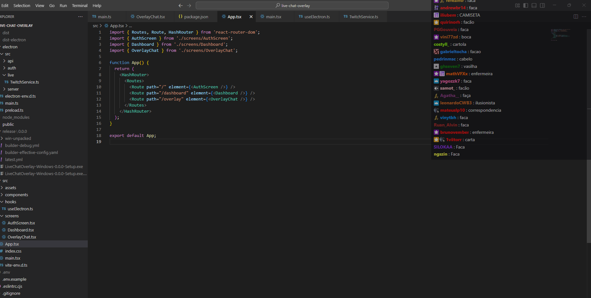

# Live Chat Overlay

A lightweight, customizable overlay application that displays live chat from multiple platforms (Twitch and TikTok) on top of your games or other applications. Perfect for streamers who want to monitor their chat while gaming or working with just one monitor.



## Features

- 🎮 **Always-On-Top Overlay**: Keeps chat visible above your games or applications
- 🖥️ **Multi-Platform Support**: Connect to both Twitch and TikTok simultaneously
- 🖼️ **Transparent Overlay**: Non-intrusive chat display that doesn't interfere with your content
- 🎨 **Customizable Appearance**: Adjust size, position, and transparency
- 🔧 **Easy Setup**: Simple authentication and channel connection
- ⚡ **Real-time Updates**: Messages appear instantly as they're sent
- 🎭 **Emote Support**: Displays Twitch emotes and badges correctly

## Tech Stack

- **[Electron](https://www.electronjs.org/)** - Cross-platform desktop application framework
- **[React](https://reactjs.org/)** - Component-based UI library
- **[TypeScript](https://www.typescriptlang.org/)** - Typed JavaScript for better development experience
- **[Vite](https://vitejs.dev/)** - Fast build tool and development server
- **[Tailwind CSS](https://tailwindcss.com/)** - Utility-first CSS framework for styling
- **[tmi.js](https://tmijs.com/)** - Twitch Messaging Interface library for connecting to Twitch chat
- **[tiktok-live-connector](https://github.com/instabot210/tiktok-live-connector)** - Library for connecting to TikTok live streams

## Prerequisites

- [Node.js](https://nodejs.org/) (v16 or higher)
- [npm](https://www.npmjs.com/) or [yarn](https://yarnpkg.com/)

## Installation

1. Clone the repository:
   ```bash
   git clone <repository-url>
   ```

2. Navigate to the project directory:
   ```bash
   cd live-chat-overlay
   ```

3. Install dependencies:
   ```bash
   npm install
   # or
   yarn install
   ```

4. Create a `.env` file based on `.env.example` and fill in your Twitch API credentials:
   ```
   TWITCH_CLIENT_ID=your_twitch_client_id
   TWITCH_CLIENT_SECRET=your_twitch_client_secret
   TWITCH_APP_NAME=your_app_name
   ELECTRON_STORE_KEY=your_encryption_key
   ```

## Development

To start the development server:

```bash
npm run dev
# or
yarn dev
```

This will launch the Electron app in development mode with hot reloading.

## Building for Production

To create a production build:

```bash
npm run build
# or
yarn build
```

This will create distributable packages for your platform in the `dist` folder.

## Usage

1. Launch the application
2. Click on "Login" to authenticate with Twitch
3. Enter your Twitch channel name and/or TikTok username
4. Adjust the overlay position and settings as needed
5. Start streaming while keeping chat visible!

## Configuration

The application uses electron-store for configuration management. Settings are stored in the following locations:

- **Windows**: `%APPDATA%\\live-chat-overlay\\`
- **macOS**: `~/Library/Application Support/live-chat-overlay/`
- **Linux**: `~/.config/live-chat-overlay/`

## Contributing

Contributions are welcome! Please follow these steps:

1. Fork the repository
2. Create a new branch: `git checkout -b feature-name`
3. Make your changes and commit them: `git commit -m 'Add some feature'`
4. Push to the branch: `git push origin feature-name`
5. Create a pull request

## License

This project is licensed under the MIT License.

## Acknowledgments

- Thanks to Twitch and TikTok APIs for making this project possible
- Inspired by streamers who need better chat monitoring solutions
- Built with the amazing open-source tools listed in the tech stack